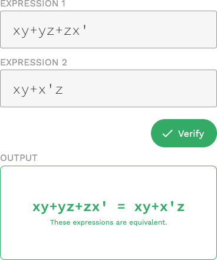

# boolean
> boolean expression parser frontend

[View the demo][demo]



A simple tool to determine if two boolean expressions are equal.

Library code is ported over from [`semibran/bool`][bool]. The truth table tab is left unclickable, though the aforementioned library has a command line interface for it.

## setup
Requires GNU Make 3.8.2 and above. Note that Mac comes packaged with 3.8.1 by default.
```sh
$ npm i
$ make watch
```

## license
[MIT](https://opensource.org/licenses/MIT) © [Brandon Semilla](https://git.io/semibran)

[bool]: https://github.com/semibran/bool
[demo]: https://semibran.github.io/boolean
